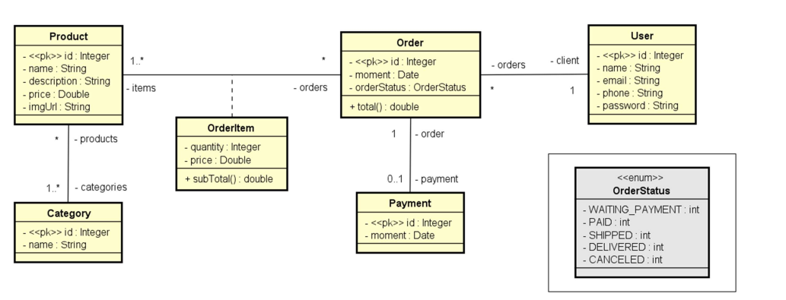
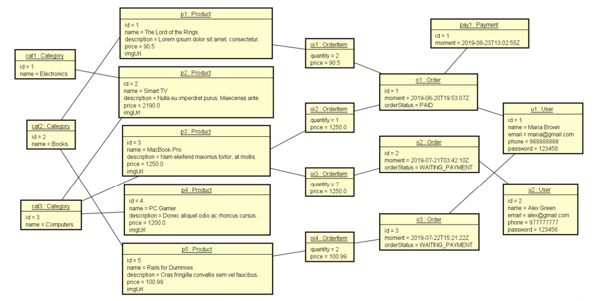
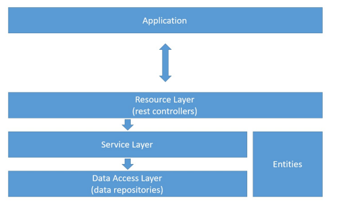

# Projeto de serviços web com Spring Boot e JPA / Hibernate

# Sobre o projeto

O projeto de serviços web é uma implementação do modelo de domínio a seguir. Nesse projeto foi feito uma estruturação das camadas lógicas: resource, service e repository. Além disso, o projeto realiza o CRUD e utiliza o banco de dados H2 para testes. É possível verificar os serviços web utilizando a ferramenta Postman.

## Modelo do domínio


## Instância do domínio


## Camadas lógicas


# Tecnologias utilizadas

[](https://skillicons.dev)
# Como executar o projeto

Pré-requisitos: Java 

```bash
# clonar repositório
git clone https://github.com/mariamourie/springboot-jpa-hibernate-project.git

# entrar na pasta do projeto back end
cd src/main/java/com/educandoweb/course

# executar o projeto
./mvnw spring-boot:run
```

# Autor

Maria Eduarda Leitão da Cruz

https://www.linkedin.com/in/maria-eduarda-cruz